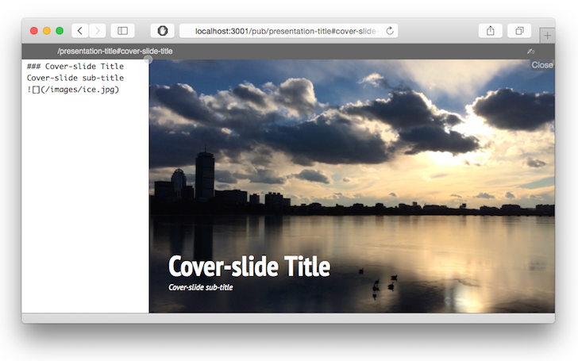

# pub-theme-shower
The [shower](https://github.com/shower/shower) theme for
[pub-server](https://github.com/jldec/pub-server) makes it easy to create
HTML presentations using markdown. Markdown headings can serve to delimit slides.

This theme replaces [pub-theme-shower-ribbon](https://www.npmjs.com/package/pub-theme-shower-ribbon) which is now deprecated.

### The main differences compared to old theme are:

- Choose between the [Material](https://github.com/shower/material/) and the [Ribbon](https://github.com/shower/ribbon/) presentation themes.
  The latter is the default. To select Material add `material: 1` to the page header.

- Choose between wide (16/9) and traditional (4/3) aspect ratio.
  The latter is the default. To select wide add `wide: 1` to the page header.

- To make headings shouty, use `# ! heading text` (on any heading level).
  Adding a `+` or `-` after the `!` animates the text to grow or shrink (only in the ribbon theme).

- Background images can be controlled by inserting markdown images with title text starting with `.cover width` or `.cover height`. 
  E.g. ``. 
  Alternatively add a `background-image: /images/ice.jpg`  to the slide fragment which auto-inserts `.cover width`.

### Usage

Edit the markdown in any text editor and use the watch feature of pub-server to auto-update a browser preview the file is saved.

When you are ready to publish, run `pub -O` to generate a set of html output and other static files.

The screenshot below shows the built-in pub-server editor (which still has a few quirks).


### tl;dr
The quickest way to start writing your own presentations using this theme is to clone the [pub-sample-deck](https://github.com/jldec/pub-sample-deck) repo from github.

This will also install pub-server in the same directory.

```sh
git clone https://github.com/jldec/pub-sample-deck.git
cd pub-sample-deck
npm install
```

### markdown
2 sample presentations are included in this repo's [example](example) folder.

The first source in pub-config has `fragmentDelim:'md-headings'`. This causes each markdown heading to be treated as the beginning of a new slide (and also serve as the heading for that slide.) The heading at the very top of the file becomes the name of the presentation.

In order to use fragment metadata for slide-specific background images, or to enable the use of additional markdown headings inside slides, separate each slide in the markdowns with a fragment delimiter. Use a name property on the first slide for the presentation name.


```md
---- #fragment-name ----
background-image: /path/to/image.jpg

markdown starts after a blank line
```

### credits
- [Vadim Makeev](https://github.com/pepelsbey):
  [Shower HTML presentation engine ](https://github.com/shower/shower)
